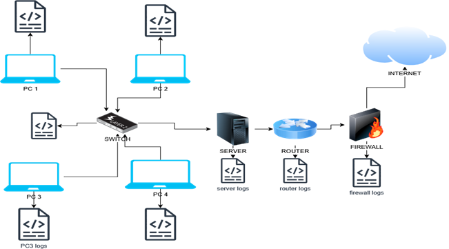
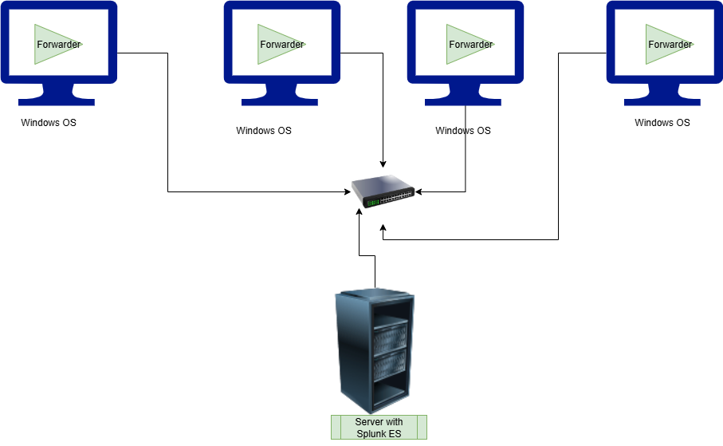

# Windows Event Monitoring Using Splunk in A Simulated SOC Lab
### SOC lab without Splunk, each component generate and keeps its logs

## Project Objectives
To simulate a basic SOC environment by collecting and monitoring system logs using Splunk ES, and creating arlets for potential security incidents( Brute force attempts, failed logins etc), create an vizualizse results on dashboards.
### SOC Labs with Splunk Forwarders ingesting logs to Splunk ES
 

## Tools Used
- Splunk ES (installed locally)
- Splunk Forwarders (Installed on VMs)
- Windows 10 VM with Sysmon installed
  ## Project Task and Steps
  ## 1 Set up Splunk ES
  - Installed Splunk locally
  - Create a Splunk Admin account
  -  Enable port 8000 access
  ## 2 Installed and configured Sysmon on windows
  - Used SwiftOnSecurity Sysmon cofiguration
  - Log key activities like process creation, network connection, file creation
  ## 3  Forward Logs to SplunK
  - Used Splunk Universal Forwarders to collect logs from VMs to Splunk ES
  - Index and Tag Log sources as Windows and Sysmon
  ## 4 Create Dashboards
  ## 5 Set Detection Alets
  ## 6 Simulate Attacks
  ## 7 Document Your Findings
  
